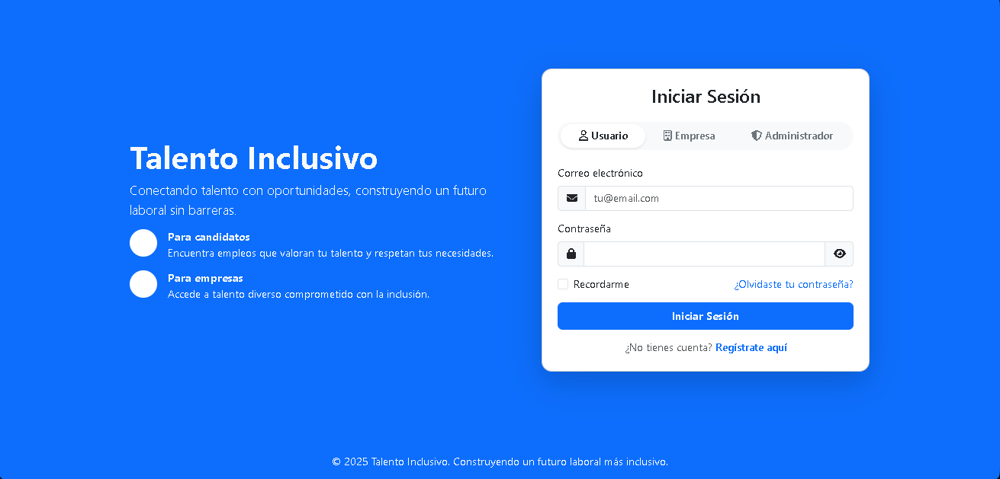

# Sistema de Inclusión Laboral para Personas con Discapacidad (SILPPD)

## Vista del sistema



Plataforma web desarrollada como proyecto académico para facilitar la conexión entre personas con discapacidad y oportunidades laborales, promoviendo la inclusión laboral mediante herramientas digitales accesibles.

## Descripción

El sistema permite la gestión de usuarios y administradores dentro de una plataforma que centraliza información laboral, perfiles de usuarios, seguimiento de postulaciones y mensajería.

La plataforma está diseñada para mejorar la accesibilidad y facilitar la interacción entre usuarios y administradores del sistema.

## Características

- Inicio de sesión con modo **Usuario** y **Administrador**
- Registro de usuarios
- Gestión de perfiles
- Sistema de mensajería
- Seguimiento de postulaciones
- Interfaz accesible y moderna

## Tecnologías utilizadas

- HTML5
- CSS3
- JavaScript
- Bootstrap
- FontAwesome

## Estructura del proyecto
```
SILPPD
│
├── Login
│ ├── login.html
│ ├── login.css
│ └── login.js
│
├── User
│ ├── perfil.html
│ ├── perfil.css
│ ├── perfil.js
│ ├── user_home.html
│ ├── user_home.css
│ ├── user_home.js
│ ├── validacion_ofertas.html
│ ├── validacion_ofertas.css
│ ├── validacion_ofertas.js
│ ├── mensajeria.html
│ ├── mensajeria.css
│ ├── mensajeria.js
│ ├── seguimiento.html
│ ├── seguimiento.css
│ └── seguimiento.js
│
├── Admin
│ ├── admin.css
│ ├── admin.html
│ ├── admin.js
│ ├── config_admin.css
│ ├── config_admin.html
│ ├── config_admin.js
│ ├── gestion.css
│ ├── gestion.html
│ ├── gestion.js
│ ├── reporte.css
│ ├── reporte.html
│ ├── reporte.js
│ ├── usuario.css
│ ├── usuario.html
│ ├── usuario.js
│ ├── validacion_empresas.css
│ ├── validacion_empresas.html
│ ├── validacion_empresas.js
└── assets
└── preview.png
```

## Instalación

1. Clonar el repositorio
git clone https://github.com/Jose-Is-gb/SILPPD.git

2. Abrir el archivo:
login.html en el navegador.

3. Crear perfil de usuario propio o entrar como administrador con:

user: admin@talentoinclusivo.com

password: admin123

## Autor

**José Gerónimo Benavides**  
Estudiante de Ingeniería de Sistemas  
Lima, Perú

GitHub:  
https://github.com/Jose-Is-gb
